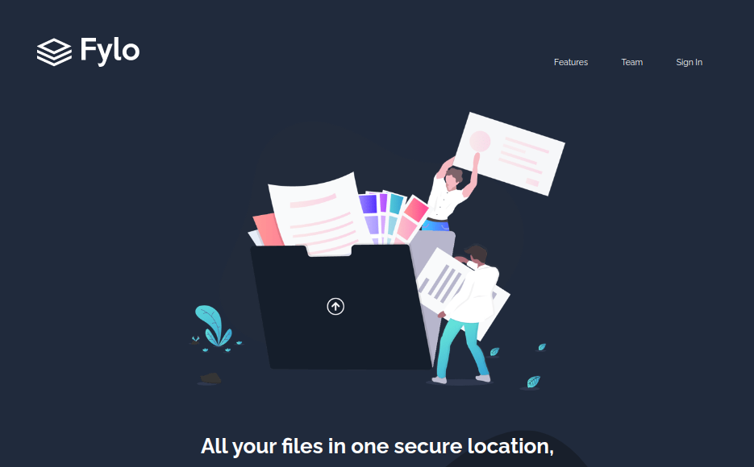
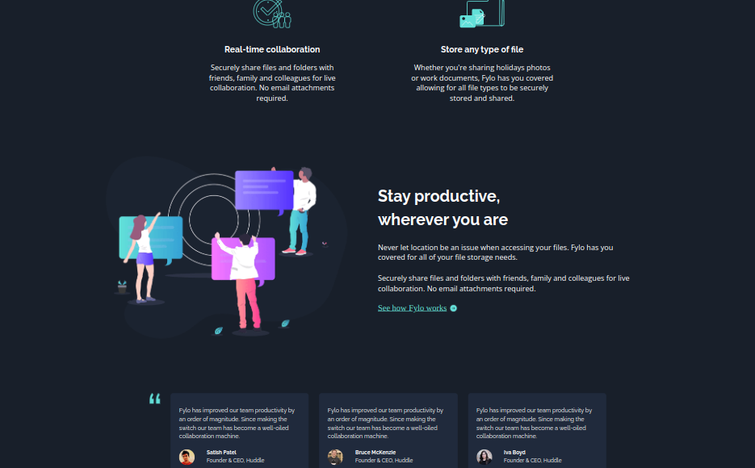
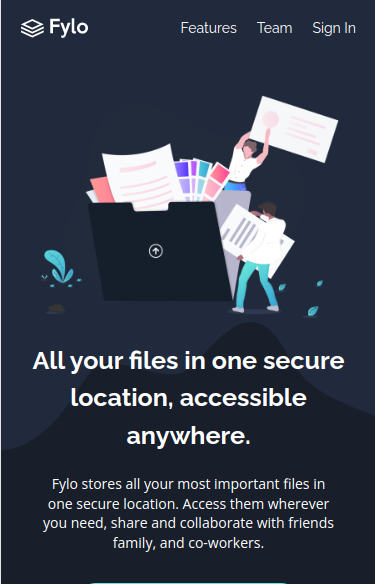
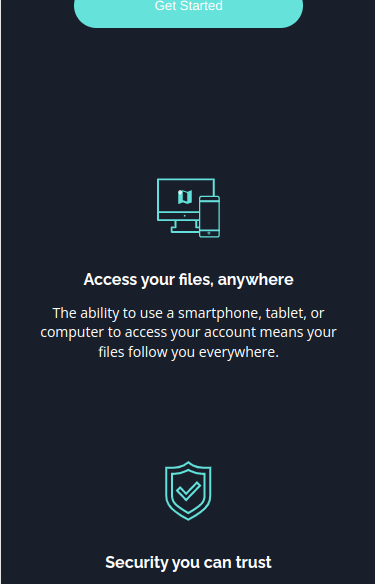
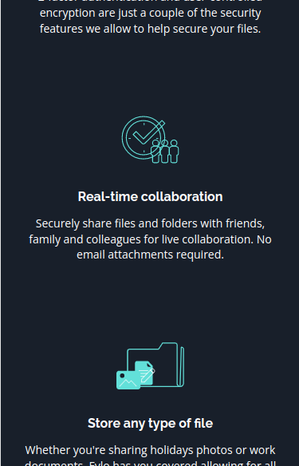
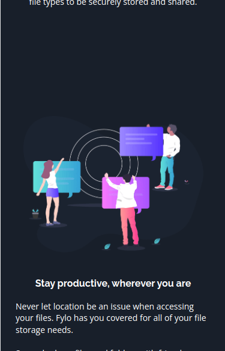
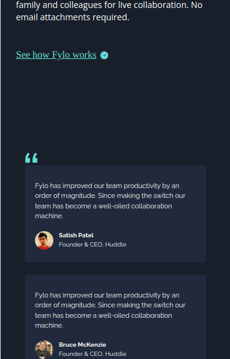
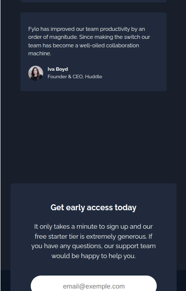
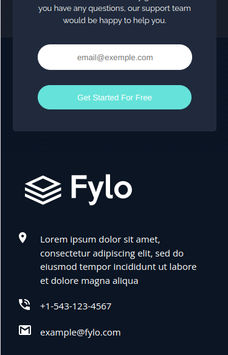
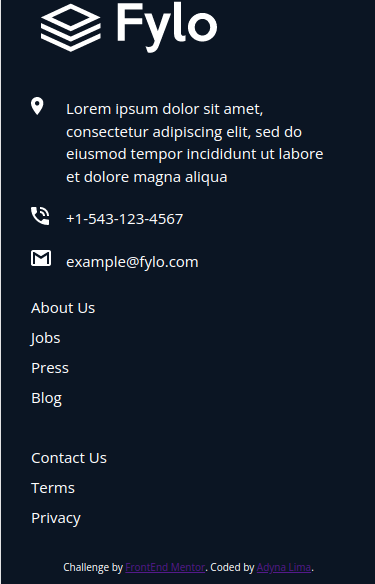

# Fylo dark theme landing page solution

Esta é uma solução para o [desafio da página de destino do tema escuro Fylo no Frontend Mentor](https://www.frontendmentor.io/challenges/fylo-dark-theme-landing-page-5ca5f2d21e82137ec91a50fd), em que construí uma Landing Page. 

## Tabela de conteúdos

- [Visãogeral](#visão-geral)
  - [Odesafio](#o-desafio)
  - [Captura de tela](#captura-de-tela)
  - [Links](#links)
- [Meu processo](#meu-processo)
  - [Tecnologias utilizadas](#tecnologias-utilizadas)
  - [Status do projeto](#status-do-projeto)
  - [Recursos úteis](#recursos-úteis)
- [Autor](#autor)
- [Licença](#licença)

## Visão geral

### O desafio

Os usuários devem ser capazes de:

- Ver o layout ideal para o site, dependendo do tamanho da tela do dispositivo

### Captura de tela

### Links

- URL da solução: [https://github.com/adynaslima/Fylo-dark-theme-landing-page.git]
- URL do site ao vivo: [https://adynaslima.github.io/Fylo-dark-theme-landing-page/] 

## Meu processo

### Tecnologias utilizadas

- Marcação HTML5 semântica
- Propriedades personalizadas CSS
- Flexbox
- Grid CSS
- Fluxo de trabalho móvel primeiro

### Status do projeto

Em construção

### Recursos úteis

- [Exemplo de recurso](https://css-tricks.com/snippets/css/a-guide-to-flexbox/) - Este é um artigo incrível que me ajudou a aplicar Flexbox. Recomendo a todos que ainda estão aprendendo esse conceito.

## Autor

- Website - [Adyna Lima](https://github.com/adynaslima)

## Licença

Licença MIT

Direitos autorais (c) 2023 Adyna Lima

A permissão é concedida, gratuitamente, a qualquer pessoa que obtenha uma cópia
deste software e arquivos de documentação associados (o "Software"), para lidar
no Software sem restrições, incluindo, sem limitação, os direitos
usar, copiar, modificar, fundir, publicar, distribuir, sublicenciar e/ou vender
cópias do Software e para permitir que as pessoas a quem o Software é
munidos para o efeito, nas seguintes condições:

O aviso de direitos autorais acima e este aviso de permissão devem ser incluídos em todos os
cópias ou partes substanciais do Software.

O SOFTWARE É FORNECIDO "COMO ESTÁ", SEM GARANTIA DE QUALQUER TIPO, EXPRESSA OU
IMPLÍCITAS, INCLUINDO, SEM LIMITAÇÃO, AS GARANTIAS DE COMERCIALIZAÇÃO,
ADEQUAÇÃO PARA UM FIM ESPECÍFICO E NÃO VIOLAÇÃO. EM NENHUM CASO O
OS AUTORES OU DETENTORES DOS DIREITOS AUTORAIS SERÃO RESPONSÁVEIS POR QUALQUER REIVINDICAÇÃO, DANOS OU OUTROS
RESPONSABILIDADE, SEJA EM UMA AÇÃO DE CONTRATO, ILÍCITO OU DE OUTRA FORMA, DECORRENTE DE,
FORA DE OU EM CONEXÃO COM O SOFTWARE OU O USO OU OUTROS NEGÓCIOS NO
PROGRAMAS.
